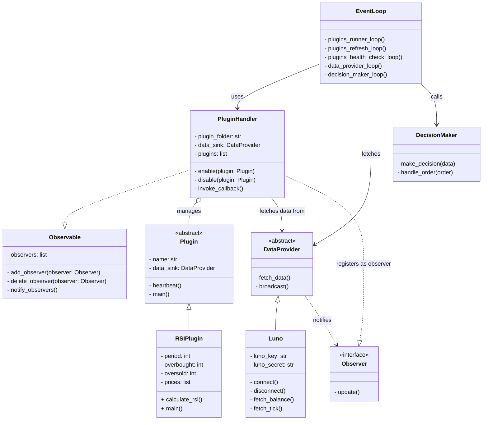

# tradebot

## Project structure

```
/project-root
    ├── /api
    │    ├── main.py                   # FastAPI entry point
    │    ├── /routers
    │    │     ├── trading.py          # API router for trading commands (async)
    │    │     ├── backtest.py         # API router for backtesting (async)
    │    ├── /auth
    │    │     └── jwt.py              # JWT authentication logic
    │    ├── /schemas
    │    │     ├── trading.py          # Pydantic schemas for trading data
    │    │     └── backtest.py         # Pydantic schemas for backtest results
    │    ├── /utils
    │    │     ├── redis.py            # Async Redis client for pub/sub communication
    │    │     └── postgres.py         # Async PostgreSQL database setup
    │    ├── /models
    │    │     ├── __init__.py         # SQLAlchemy models for database tables
    │    ├── /backtester
    │    │     └── backtester.py       # Asynchronous backtesting engine
    │    ├── /test
    │    │     ├── 
    │    │     └── 
    │    ├── requirements.txt          # Dependencies for FastAPI and asyncpg
    │    └── Dockerfile                # FastAPI Dockerfile
    ├── /bot
    │    ├── main.py                   # Entry point for the trading bot (async)
    │    ├── /strategies               # Plugin strategies for the bot
    │    │     ├── SMAPlugin.py        # Simple Moving Average strategy (async)
    │    │     ├── EMAPlugin.py        # Exponential Moving Average strategy (async)
    │    │     └── RSIPlugin.py        # Relative Strength Index strategy (async)
    │    ├── /utils
    │    │     └── async_database.py   # Async database setup for the bot
    │    ├── /test
    │    │     ├── 
    │    │     └── 
    ├── docker-compose.yml             # Docker Compose configuration
    └── /tests
         ├── test_decision_maker.py    # Unit tests for the decision maker (async)
         ├── test_data_provider.py     # Unit tests for the data provider (async)
         └── test_plugin_handler.py    # Unit tests for plugin management (async)
```


