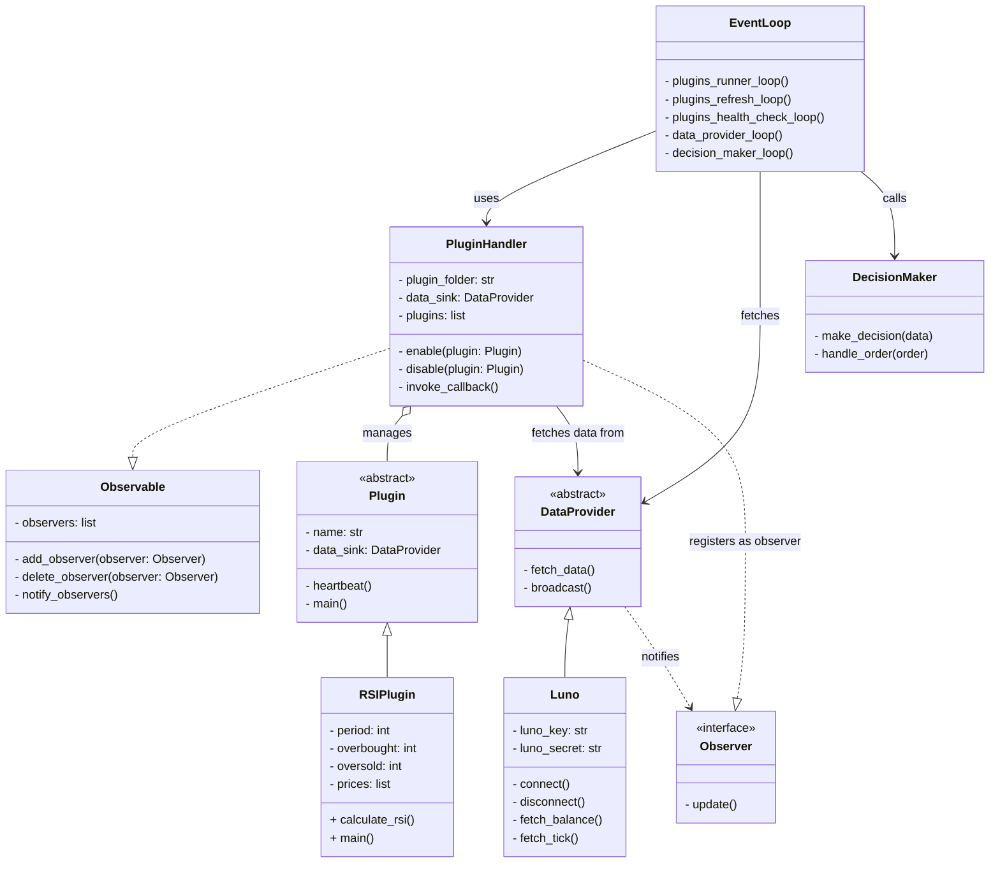

# tradebot

## High-Level Architecture

This project is transitioning towards a microservice-based architecture to enhance modularity, scalability, and maintainability. The core trading logic resides in the main `bot` service, while exchange-specific interactions are delegated to dedicated connector microservices.

-   **`binance-connector`**: This is the first exchange-specific microservice, responsible for all interactions with the Binance API. It fetches market data (tickers, order books, trades), manages account balances, and handles order placement and status tracking for Binance.
-   **Redis Streams for Communication**: The primary method for communication between the `bot` service and connector services (like `binance-connector`) is Redis Streams.
    -   **Commands**: The `bot` sends commands (e.g., place order) to connectors via dedicated Redis Streams.
    -   **Events**: Connectors publish market data, order status updates, and balance updates back to the `bot` via separate Redis Streams.
-   **`common_models/` Shared Library**: A shared library (`common_models/`) containing Pydantic models is used to ensure data consistency for messages passed through Redis Streams between the `bot` and connector services.

## Services Overview

The system is composed of several services orchestrated via `docker-compose.yml`:

-   **`bot`**: The main trading bot application. It consumes market data, applies trading strategies (plugins), makes trading decisions, and sends order commands to connector services. It also hosts a `/health` and `/metrics` endpoint.
-   **`binance-connector`**: A microservice dedicated to Binance. It:
    -   Connects to the Binance API.
    -   Streams market data (tickers, order books, trades) to Redis.
    -   Listens for order commands from the `bot` service via Redis.
    -   Places orders on Binance and publishes order status updates and account balance information back to Redis.
    -   Exposes `/health` and `/metrics` endpoints.
-   **`luno-connector`**: A microservice dedicated to Luno. It mirrors the `binance-connector`'s functionality for the Luno exchange:
    -   Connects to the Luno API.
    -   Streams market data (e.g., XBT/ZAR ticker, order book, trades) to Redis.
    -   Listens for order commands from the `bot` service via Redis.
    -   Places orders on Luno and publishes order status updates and account balance information back to Redis.
    -   Exposes `/health` and `/metrics` endpoints.
-   **`api`**: (If applicable - describe its role, e.g., "A FastAPI service for external API interactions, potentially for a UI or third-party integrations.") *Currently a basic placeholder.*
-   **`postgres`**: PostgreSQL database for storing historical market data, trade history, etc.
-   **`redis`**: Redis instance used for caching, message queuing (Redis Streams), and real-time data distribution.
-   **Monitoring Stack**:
    -   `prometheus`: Collects metrics from services.
    -   `grafana`: Visualizes metrics from Prometheus.
    -   `elasticsearch`, `logstash`, `kibana`: For centralized logging (ELK stack).

## Setup and Running

1.  **Environment Variables**:
    -   Copy `.env.example` to `.env`.
    -   For the `binance-connector` service to function, you **must** provide your Binance API credentials in the `.env` file:
        -   `BINANCE_API_KEY=your_actual_api_key`
        -   `BINANCE_API_SECRET=your_actual_api_secret`
    -   For the `luno-connector` service to function, you **must** provide your Luno API credentials in the `.env` file:
        -   `LUNO_API_KEY_ID=your_luno_api_key_id`
        -   `LUNO_API_SECRET_KEY=your_luno_api_secret_key`
    -   Other configurations (database credentials, etc.) are pre-set in `docker-compose.yml` but can be customized in `.env` if needed.

2.  **Build and Run**:
    ```bash
    docker-compose up --build -d
    ```

3.  **Accessing Services**:
    -   **Bot Health**: `http://localhost:5000/health`
    -   **Bot Metrics**: `http://localhost:5000/metrics`
    -   **Binance Connector Health**: `http://localhost:8001/health`
    -   **Binance Connector Metrics**: `http://localhost:8001/metrics`
    -   **Luno Connector Health**: `http://localhost:8002/health`
    -   **Luno Connector Metrics**: `http://localhost:8002/metrics`
    -   **API Service (placeholder)**: `http://localhost:8000/health`
    -   **Grafana**: `http://localhost:3000`
    -   **Kibana**: `http://localhost:5601`

## Project structure

```
/project-root
    ├── /api                              # FastAPI service (currently placeholder)
    │    ├── Dockerfile
    │    ├── main.py
    │    └── requirements.txt
    ├── /bot
    │    ├── main.py                       # Entry point for the trading bot (async)
    │    ├── Dockerfile                    # Dockerfile for the bot
    │    ├── requirements.txt              # Dependencies for the bot
    │    ├── log_config.yml                # Logging configuration
    │    ├── binance.py                    # Binance exchange integration
    │    ├── kraken.py                     # Kraken exchange integration
    │    ├── luno.py                       # Luno exchange integration
    │    ├── data_provider.py              # Data provider logic
    │    ├── database.py                   # Database interaction logic
    │    ├── decision_maker.py             # Trading decision logic
    │    ├── event_loop.py                 # Main event loop for the bot
    │    ├── observer.py                   # Observer pattern implementation
    │    ├── plugin.py                     # Base plugin class
    │    ├── plugin_handler.py             # Plugin management logic
    │    ├── storage.py                    # Storage interaction logic
    │    ├── /plugins
    │    │    └── /technical_indicators
    │    │         ├── BollingerBands.py   # Bollinger Bands strategy (async)
    │    │         ├── EMA.py              # Exponential Moving Average strategy (async)
    │    │         ├── RSI.py              # Relative Strength Index strategy (async)
    │    │         └── SMA.py              # Simple Moving Average strategy (async)
    │    ├── /test
    │    │     ├── data_provider.py        # Unit tests for data provider
    │    │     ├── decision_maker.py       # Unit tests for decision maker
    │    │     ├── plugin_handler.py       # Unit tests for plugin handler
    │    │     ├── test_backtest.py        # Unit tests for backtesting
    │    │     └── test_trade.py           # Unit tests for trading
    ├── /common_models                    # Shared Pydantic models for Redis communication
    │    ├── __init__.py
    │    ├── market_data_models.py
    │    └── commands_events_models.py
    ├── /connectors                       # Exchange-specific connector microservices
    │    ├── /binance_connector
    │    │    ├── Dockerfile
    │    │    ├── main.py                 # Entry point for Binance connector
    │    │    └── requirements.txt
    │    └── /luno_connector
    │         ├── Dockerfile
    │         ├── main.py                 # Entry point for Luno connector
    │         └── requirements.txt
    ├── /config                           # Configuration files
    │    ├── log_config.yml
    │    ├── /logstash
    │    │    └── logstash.conf
    │    ├── /prometheus
    │    │    └── prometheus.yml
    │    └── redis.conf
    ├── docker-compose.yml                # Docker Compose configuration
    ├── .env.example                      # Example environment variables
    ├── .gitignore
    ├── LICENSE
    ├── README.md
    ├── /postgres                         # PostgreSQL setup
    │    ├── Dockerfile
    │    ├── init.sql
    │    └── load-extensions.sh
    └── /tests                             # (Potentially for integration tests or other tests)
         # Note: Tests might need restructuring to align with microservices
         ├── test_decision_maker.py       
         ├── test_data_provider.py        
         └── test_plugin_handler.py       
```


