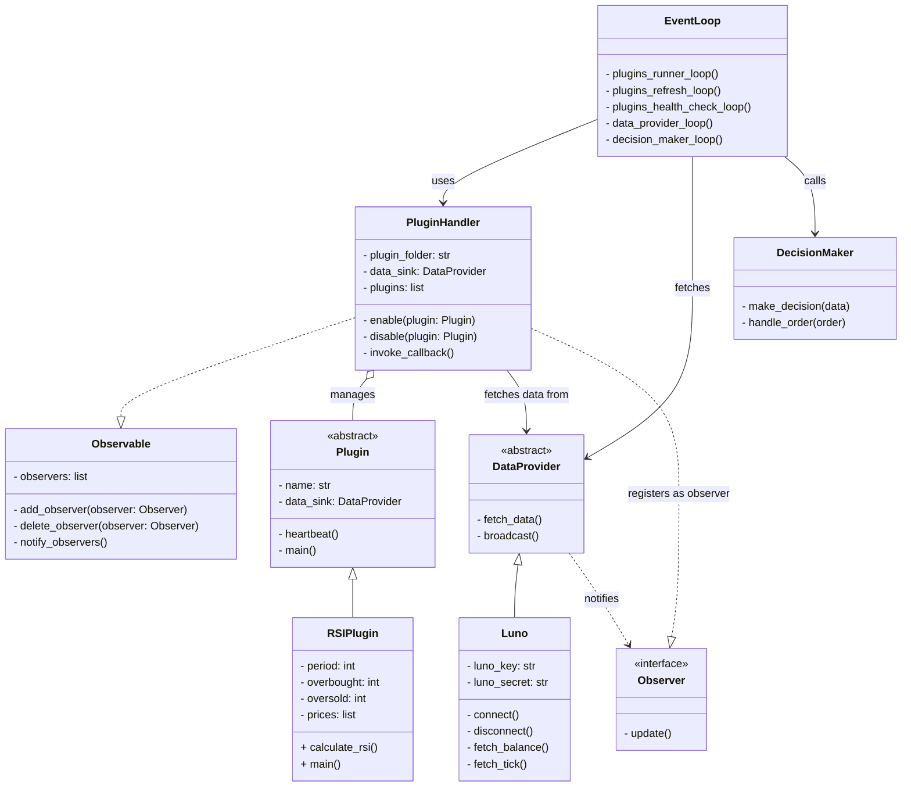

# tradebot

## Project structure

```
/project-root
    ├── /bot
    │    ├── main.py                       # Entry point for the trading bot (async)
    │    ├── Dockerfile                    # Dockerfile for the bot
    │    ├── requirements.txt              # Dependencies for the bot
    │    ├── log_config.yml                # Logging configuration
    │    ├── binance.py                    # Binance exchange integration
    │    ├── kraken.py                     # Kraken exchange integration
    │    ├── luno.py                       # Luno exchange integration
    │    ├── data_provider.py              # Data provider logic
    │    ├── database.py                   # Database interaction logic
    │    ├── decision_maker.py             # Trading decision logic
    │    ├── event_loop.py                 # Main event loop for the bot
    │    ├── observer.py                   # Observer pattern implementation
    │    ├── plugin.py                     # Base plugin class
    │    ├── plugin_handler.py             # Plugin management logic
    │    ├── storage.py                    # Storage interaction logic
    │    ├── /plugins
    │    │    └── /technical_indicators
    │    │         ├── BollingerBands.py   # Bollinger Bands strategy (async)
    │    │         ├── EMA.py              # Exponential Moving Average strategy (async)
    │    │         ├── RSI.py              # Relative Strength Index strategy (async)
    │    │         └── SMA.py              # Simple Moving Average strategy (async)
    │    ├── /test
    │    │     ├── data_provider.py        # Unit tests for data provider
    │    │     ├── decision_maker.py       # Unit tests for decision maker
    │    │     ├── plugin_handler.py       # Unit tests for plugin handler
    │    │     ├── test_backtest.py        # Unit tests for backtesting
    │    │     └── test_trade.py           # Unit tests for trading
    ├── docker-compose.yml                # Docker Compose configuration
    └── /tests                             # (Potentially for integration tests or other tests)
         ├── test_decision_maker.py       # Unit tests for the decision maker (async) - Note: Appears duplicated, confirm if these are different tests
         ├── test_data_provider.py        # Unit tests for the data provider (async) - Note: Appears duplicated, confirm if these are different tests
         └── test_plugin_handler.py       # Unit tests for plugin management (async) - Note: Appears duplicated, confirm if these are different tests
```


